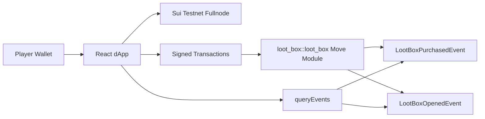

# Loot Box System on Sui

[](https://sui.io)
[](https://docs.sui.io)
[](https://react.dev)
[](#current-status)

An end-to-end loot box dApp built on Sui with:

- On-chain loot box purchase and opening
- Weighted rarity generation using Sui randomness
- CS2-themed item naming
- Event-driven history for persistent frontend state
- Wallet-connected React UI for real transactions

## Why this project is cool

- Verifiable randomness path using Sui shared Random object
- Real on-chain events as source of truth for player history
- Capability-based admin and one-time initialization hardening
- Full flow demonstrated across contract, tests, and frontend

## Current status

- Move package builds successfully
- Move tests pass
- Frontend builds successfully
- Contract calls verified on-chain for init, purchase, and open

## Architecture



## Smart contract overview

Location: sources/loot_box_system.move

### Core structs

- AdminCap: capability object for admin operations
- GameConfig: shared game settings and treasury tracking
- LootBox: user-owned unopened loot box object
- GameItem: minted item object containing rarity, power, and name

### Core entry functions

- init_game: one-time initialization guarded by Publisher
- purchase_loot_box: validates payment, updates treasury, mints LootBox
- open_loot_box: consumes LootBox, generates rarity and power, mints GameItem
- update_rarity_weights: admin-only weight updates with sum validation

### Events

- LootBoxPurchasedEvent
- LootBoxOpenedEvent

Frontend consumes LootBoxOpenedEvent to render persistent history.

## Frontend overview

Location: lootbox-ui

### Features

- Browser wallet connect button
- Buy Loot Box transaction flow
- Open Loot Box transaction flow
- Event-based history loaded from chain
- Loading, error, and transaction status handling

### Environment variables

Create lootbox-ui/.env with:

```env
VITE_PACKAGE_ID=0xYOUR_PACKAGE_ID
VITE_GAMECONFIG_ID=0xYOUR_SHARED_GAMECONFIG_ID
VITE_RANDOM_ID=0x8
VITE_PAYMENT_AMOUNT=100
```

Compatibility note:

- Both VITE_GAMECONFIG_ID and VITE_GAME_CONFIG_ID are supported by the frontend parser.

## Repository layout

```text
loot_box_system/
  Move.toml
  sources/
    loot_box_system.move
  tests/
    loot_box_system_tests.move
  lootbox-ui/
    src/
      App.tsx
      main.tsx
      lib/
        env.ts
        events.ts
        types.ts
```

## Local development

### 1) Smart contract

```bash
sui move build
sui move test
```

### 2) Frontend

```bash
cd lootbox-ui
npm install
npm run dev
```

### 3) Production frontend build

```bash
cd lootbox-ui
npm run build
```

## Example on-chain calls

Replace IDs with your own where needed.

### Purchase

```bash
sui client call \
  --package <PACKAGE_ID> \
  --module loot_box \
  --function purchase_loot_box \
  --args <GAMECONFIG_ID> <SUI_COIN_OBJECT_ID> \
  --gas-budget 20000000
```

### Open

```bash
sui client call \
  --package <PACKAGE_ID> \
  --module loot_box \
  --function open_loot_box \
  --args <LOOTBOX_OBJECT_ID> <GAMECONFIG_ID> 0x8 \
  --gas-budget 20000000
```

## Security and design notes

- Initialization is hardened to prevent repeated init by arbitrary callers.
- Rarity weights are validated to total 100.
- Payment path uses split and refund semantics.
- LootBox is consumed on open, preventing reuse.

## Roadmap

- Add dedicated network selector UI
- Add transaction explorer deep links
- Add richer admin dashboard for rarity and treasury controls
- Expand integration tests with more scenario coverage

## Hackathon pitch summary

This project demonstrates a complete gameplay loop anchored to on-chain state:

1. Buy loot box on Sui
2. Open with weighted randomness
3. Mint item with rarity, power, and CS2-themed name
4. Persist and replay history via events

Clean, verifiable, and demo-ready.
